Have you ever wanted to try a new programming language but gave up because of all the prerequisites you need to install? Or you wanted to make a small change in a (old) project only to find out that you need another version of the programming language than the one currently installed on your PC? With **development containers** (or **dev containers**), this can be something of the past.  
According to the [documentation](https://code.visualstudio.com/docs/remote/containers), a dev container is a Docker container, setup to run an application or to sandbox tools, libraries, or runtimes needed for working with a codebase. The Visual Studio Code **Remote - Containers** extension makes it easy to setup a dev container and use it as a full-featured development environment.
Once setup, you can store the configuration files (container definition) with the other project files, so that whenever needed you can recreate the same development environment using the container definition.

## Prerequisites

- [Docker Desktop](https://www.docker.com/products/docker-desktop)
- [Visual Studio Code](https://code.visualstudio.com/)
- [Remote - Container](vscode:extension/ms-vscode-remote.remote-containers) VS Code extension

## Setup a dev container for a new project

In this paragraph we will setup a dev container to write code in Python 3:

- Start Visual Studio Code
- Open the Command Palette with <kbd>F1</kbd> or <kbd>Ctrl</kbd> + <kbd>Shift</kbd> + <kbd>P</kbd>
- Enter `remote container` and select `Remote Containers: Open Folder in Container...`
  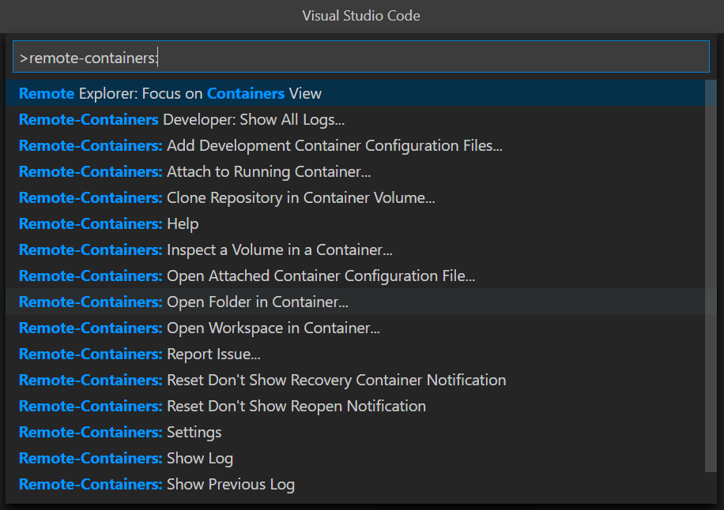
- In the `Select Folder` dialog, create a new folder for the Python project, select it and click <kbd>Open</kbd>
- In the `Add Development Container Configuration Files` dialog, select `Show All Definitions...`
  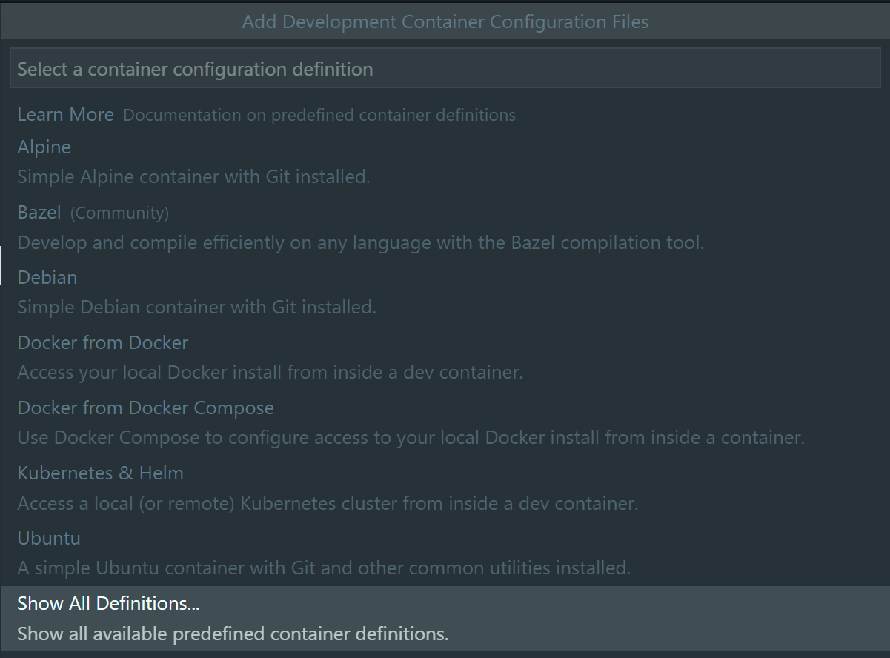
- Enter `p` and select `Python 3`
  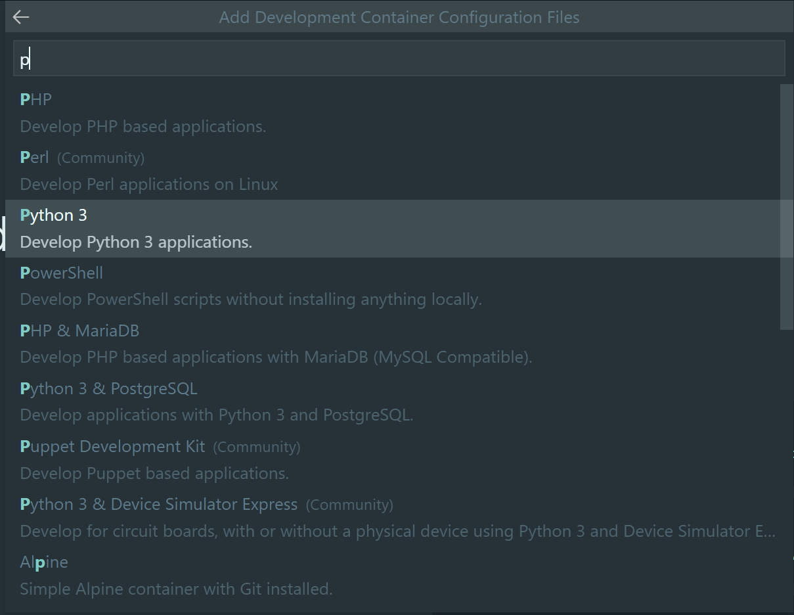
- Select a Python version
  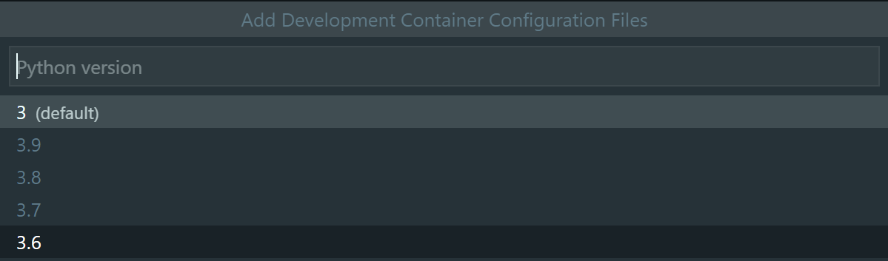
- Select Python 3 dev container options. You can accept default selections. Click <kbd>Ok</kbd> to continue.
  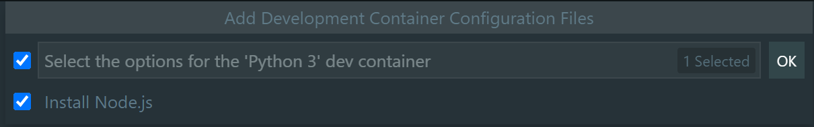
- The following message will be displayed in the `Remote Status` bar item during the setup of the dev container
  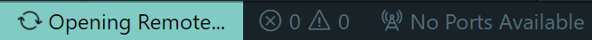
- When setup is finished, the following message will be displayed in the `Remote Status` bar item
  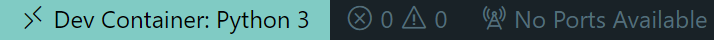  
  In the `EXPLORER` pane you can find the folder and files that make up the dev container definition
  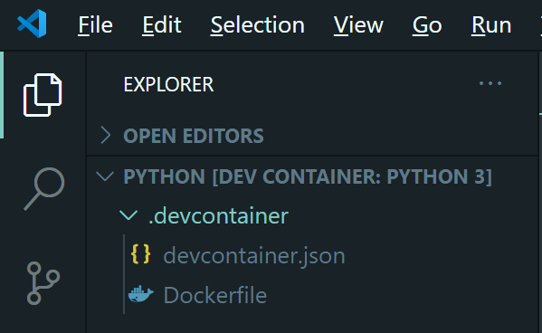
- Open a terminal with <kbd>Ctrl</kbd> + <kbd>\`</kbd> and enter `python --version` to verify that you can run python code in the container
  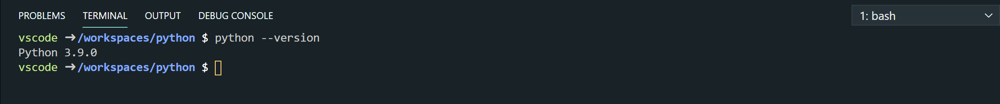
- Create a Python module to debug/run it in Visual Studio Code

  ``` python
  def SayHello(name):
    message = "Hello dev container & " + name
    print(message)

  SayHello("docker")
  ```

  Set a breakpoint on line 3 by clicking left of line 3. A red dot will then appear.
  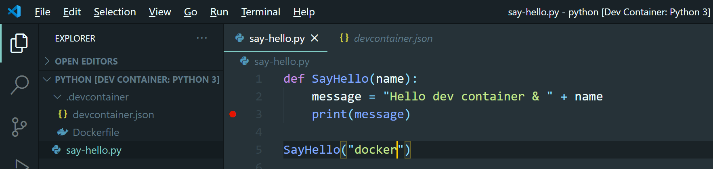
- Press <kbd>F5</kbd> to start a debug session. In the figure below you can see the debugger stops at the breakpoint and in the variables panel, you can see the local variables and their value.
  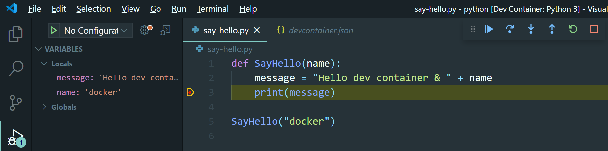
- When you are finished working in the Python project, click on the `Remote Status` bar to show the available commands for the open container in the Command palette. Select `Close Remote Connection`
  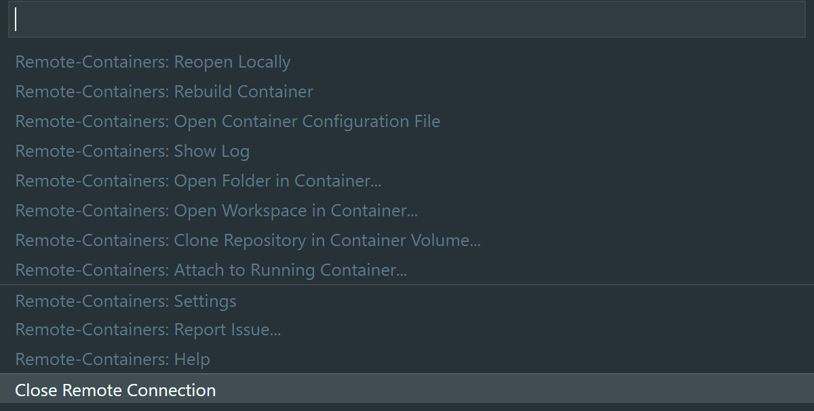
